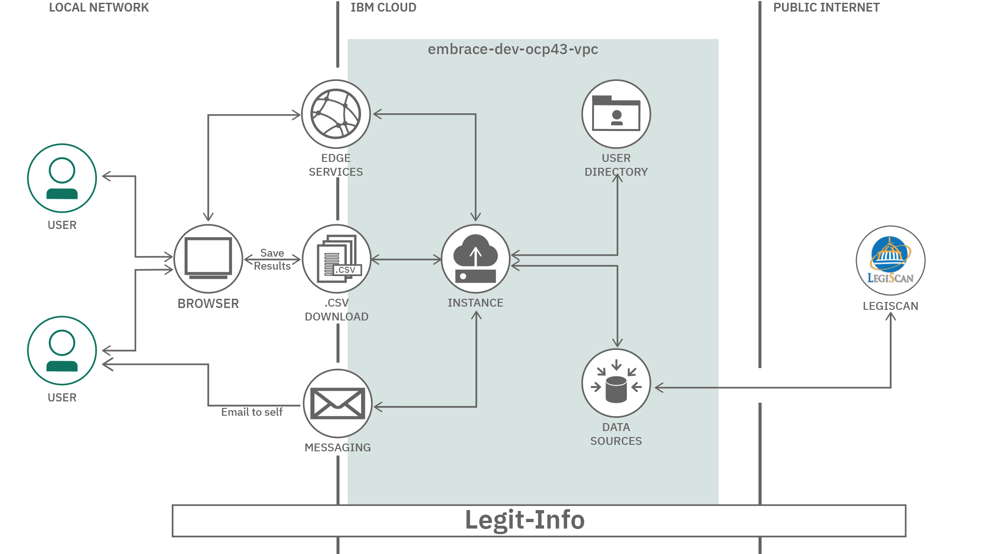
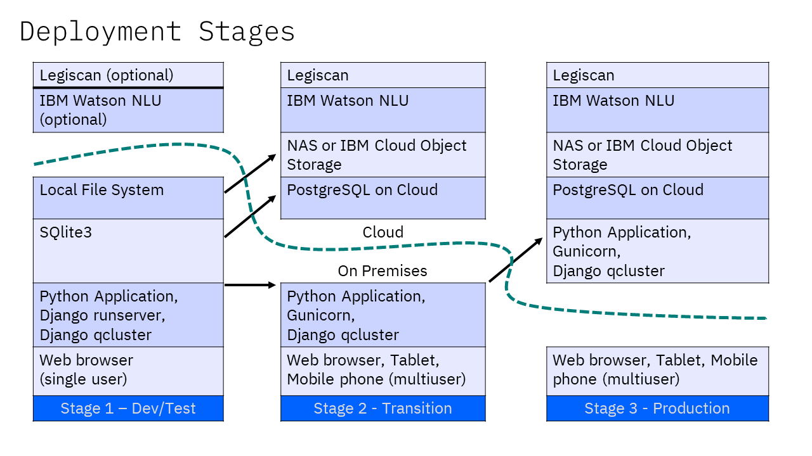

  

# Legit-Info

Concerned citizens and impacted residents don't have a straightforward way of 
knowing what or how policies and regulations impact them or what they can do 
in response.  A community leader could use this tool to help motivate their
social followers.

## Contents

1. [Short Description](#short-description)
1. [Demo Video](#demo-video)
1. [The Architecture](#the-architecture)
1. [Getting Started](#getting-started)
1. [Contributing](#contributing)
1. [Suggestions](#suggestions)
1. [License](#license)

## Short Description

### Policy and Legislation Reform

Technology has the power to drive action. And right now, a call to action is
needed to eradicate racism. **Black lives matter.**

We recognize technology alone cannot fix hundreds of years of racial injustice
and inequality, but when we put it in the hands of the Black community and
their supporters, technology can begin to bridge a gap. To start a dialogue.
To identify areas where technology can help pave a road to progress.

This project is an effort to utilize technology to analyze, inform, and
develop policy to reform the workplace, products, public safety, and
legislation.

This is one of several open source projects underway as part of the Call for 
Code for Racial Justice led by contributors from IBM and Red Hat.

### What's the problem?

Concerned citizens and impacted residents don't have a straightforward way of 
knowing what or how policies and regulations impact them or what they can do 
in response.  A community leader could use this tool to help motivate their
social followers. Our target user will be referred to as "advocate".

#### Hills (who, what, and wow)

1. Advocates are aware of policy that is being considered that is 
highly impactful to them, without needing to follow every vote.

2. Advocates are able to understand the specific impact of proposed 
policy on them without being a legal expert.

3. Advocates are able to share opinions so they can influence policy 
decisions before they are finalized.

4. Advocates can easily ascertain the voting record themes or trend of their
elected officials and political candidates without prior knowledge of who
they are.

5. Policy makers have visibility into how diverse citizenry will be impacted
by multiple variations of a proposed policy.

### How can technology help?

Searching for legislation can be complicated by the fact that each government
level has their own repository, their own numbering convention, and different
formats.  Technology can assist by allowing content to be centralized
into a single database, in a consistent format,  readily accessible to 
advocates that need simple-to-read information.

### The idea  - Legit-Info App

This is a web-based application written in Python programming
language, using the Django framework and Bootstrap user interface styling. Its 
primary goal is to help advocates find legislation of interest based on an
advocate's preferences for impact areas and geographical location. 

The application is customizable, allowing application staff to specify
the location hierarchy and impact categories.

The database is automatically updated weekly, combining the resources from 
Legiscan.com API with government repositories.  Plain text is extracted from 
HTML and PDF formatted documents, processed through IBM Watson Natural Language 
Understanding (NLU) service to identify title, summary, location,
and impact.  The results can then be further curated to improve legibility.

By classifying legislation by impact and location, we hope to increase 
awareness of current and pending legislation and their ability to affect change 
through voting or other activism.

[More detail is available here](DESCRIPTION.md)

## Demo Video

## The Architecture

## Getting Started

These instructions will get you a copy of the project up and running on your 
local machine for development and testing purposes. See deployment for notes 
on how to deploy the project on a live system.

### Deploying the Solution Locally
**_Prerequisites: Python, pip, pipenv_**

1. Clone the Legit-Info Git repository 

`git clone https://github.com/Call-for-Code-for-Racial-Justice/Legit-Info.git`

2. Navigate to the Legit-Info directory

`cd Legit-Info`

3. Install the dependencies using `pipenv`.

`pipenv install`

4. Use the following command if you already have installed the dependencies and want to activate the virtual environment only.

`pipenv shell`
 
5. Use the following commands to create your local database. (If you are using Windows, there will be command variations for the next 3 steps)

`./stage1 makemigrations` 

`./stage1 migrate`

Windows

`stage1.bat makemigrations`

`stage1.bat migrate`

6. Run the following command to generate a default user with some pre-existing impacts and locations. This creates an admin user `cfcadmin` with the password `Call4Code`.

`./stage1 loaddata sources/cfc-seed.json`

Windows

`stage1.bat loaddata sources/cfc-seed.json`

7. Run the application with the following command.

`./stage1 runserver localhost:3000`

Windows

`stage1.bat runserver localhost:3000`

### States of Deployment

This project is designed for three deployment stages.

1. [Development](docs/STAGE1.md)

In stage 1, each developer has their own copy of application code and
data, using SQLite3 that stores the entire database in a single file.
Django provides a development webserver to allow local testing.

The original PDF or HTML version of the legislation, along with the extracted
TEXT files, are stored on local file system and analyzed.  The resulting
title, summary, location and impact are stored in the database.  This
allows staff to review the AI/NLP-based classifications and make adjustments.

2. [Transition](docs/STAGE2.md)

In stage 2, each developer has their own copy of application code, but
a shared database, using Postgresql running in the IBM Cloud.  The
developer can choose to use the Django development webserver, or try out
the production server called Gunicorn.  The difference is that Django
is designed for single-user, and Gunicorn for concurrent multiple users.

Optionally, the PDF, HTML and TEXT files of the legislation can be stored
on a network file system or IBM Cloud Object Storage for shared access.

3. [Production](docs/STAGE3.md)

In stage 3, the application is running in the IBM Cloud in one pod, using the
Postgresql running in the IBM Cloud from pre-production.  Updates to the
code are deployed using a Tekton pipeline.

The PDF, HTML and TEXT files of the legislation can be stored on the same
web application container, a network file system, or IBM Cloud Object Storage.

## Contributing

Please read [CONTRIBUTING.md](CONTRIBUTING.md) for details on the code of 
conduct, and the process for submitting pull requests to the project.  This
project adheres to the PEP 8 Python Coding Style Guidelines, Django naming
conventions, and other standards. See [STYLE.md](docs/STYLE.md) for details.

## Suggestions

This starter kit can be taken in a variety of directions.

1. **Email:**

Without an email SMTP server, we used instead `Mailtrap.io`
which allowed testing of the HTML and TEXT formats.  Considering adding
an SMTP server to send out email.

2. **Permission Levels:**

The Superuser can grant privileges to other users, and
this could be implemented as a "upgrade user to Staff" button option with
specific privilege levels pre-set.

3. **Share options:**

The advocate can share results three ways: (a) print
out the results on paper or PDF file; (b) email to self then forward that
email to others from their regular email system, and (c) download CSV file
to send out to others or perform other analyses.  Additional options could
be to send out tweets on Twitter, post to a Blog, or send out to other 
social media outlets like Facebook.

4. **Feedback options:**

Add information to each law related to the proponents
or opponents, these could be elected officials or activists that are actively
involved with the legislation.  Feedback options can be to send opinions
directly to those people, or to allow those elected officials to easily see the
collection of opinions directly from the website.

5. **Other locations and languages:**

The solution is focused on United States and the English language.  The
MVP focused on just Arizona and Ohio. However, the location hierarchy does 
accomodate different governmental structures, and the Impact, Location, Title 
and Summary all support UTF-8 character set to allow for international 
characters.  This solution could be modified to handle other locations, 
evaluating alternatives to Legiscan.com, and finding other public sources of 
information for the particular country or language.

## Built with IBM and Open Source Technologies

The web application and cron job use the following IBM and open source
technologies.

### Used Within Deployment Stage 1
* [Python](https://www.python.org/) - The programming language, along with
pip and pipenv supporting tools
* [Django](https://www.djangoproject.com/) - A framework for web applications
written in Python
* [Bootstrap](https://getbootstrap.com/) - A popular User Interface toolkit, 
providing "responsive UI" to handle different screen sizes across smartphones,
tablets and desktops.
* [PDFminer](https://pypi.org/project/pdfminer.six/) - Extracts text from PDF
* [SQlite](https://www.sqlite.org/index.html) - A simple, local database

### Additional Technologies for Deployment Stage 2 & 3
* [Postgresql](https://www.postgresql.org/) - A robust, relational database
* [Gunicorn](https://gunicorn.org/) - A WSGI HTTP webserver for Python
* [NLTK](https://github.com/nltk/nltk) - Natural Language Toolkit
* [Watson Studio Natural Language Understanding](https://www.ibm.com/watson/nlu)

### The following repositories are used to automate the collection of legislation:

* [Legiscan.com](https://legiscan.com/) -- API for all 50 USA states
* [AZLeg.gov](https://www.azleg.gov/) -- Arizona State Legislature website
* [Ohio.gov](https://ohio.gov/wps/portal/gov/site/home/) -- Ohio State website

### The following technologies were used to deploy and demonstrate the MVP. Certainly, they are optional, as the above application can run on a traditional LAMP stack bare-metal server or virtual machine.

* [Red Hat UBI](https://catalog.redhat.com/software/containers/ubi8)  - Red Hat
  Universal Base Image, based on Red Hat Enterprise Linux (RHEL) 8.2
* [Docker](https://www.docker.com/) - A container platform
* [Kubernetes](https://kubernetes.io/) - An orchestration layer for Docker
* [Red Hat OpenShift](https://www.openshift.com/) - Red Hat container platform
  based on Kubernetes
* [Tekton](https://www.openshift.com/learn/topics/pipelines) - A Continuous 
  Integration (CI) pipeline

## License

This project is licensed under the Apache 2 License - see the [LICENSE](LICENSE) file for details
Please also read the [BSD Copyright Notice](BSD-NOTICE)
