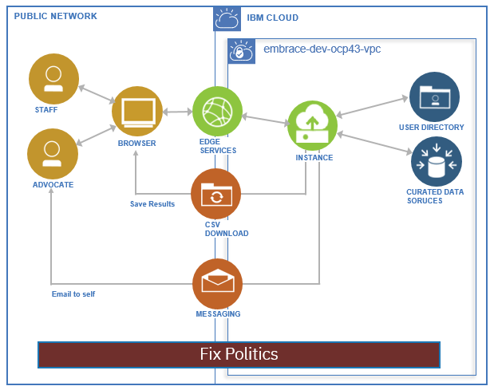

# Fix Politics

 

## Contents

1. [Short description](#short-description)
1. [Demo video](#demo-video)
1. [The architecture](#the-architecture)
1. [Long description](#long-description)
1. [Getting started](#getting-started)
1. [Running the tests](#running-the-tests)
1. [Built with](#built-with)
1. [Contributing](#contributing)
1. [Versioning](#versioning)
1. [Authors](#authors)
1. [License](#license)
1. [Acknowledgments](#acknowledgments)

## Short description

### Emb(race): Policy and Legislation Reform

Technology has the power to drive action. And right now, a call to action is
needed to eradicate racism. **Black lives matter.**

We recognize technology alone cannot fix hundreds of years of racial injustice
and inequality, but when we put it in the hands of the Black community and
their supporters, technology can begin to bridge a gap. To start a dialogue.
To identify areas where technology can help pave a road to progress.

This project is an effort to utilize technology to analyze, inform, and
develop policy to reform the workplace, products, public safety, and
legislation.

This is one of three open source projects underway as part of the [Call for 
Code Emb(race) Spot Challenge](https://github.com/topics/embrace-call-for-code) 
led by contributors from IBM and Red Hat.

### What's the problem?

Concerned citizens and impacted residents don't have a straightforward way of 
knowing what or how policies and regulations impact them or what they can do 
in response.  A community leader could use this tool to help motivate their
social followers.  Our target user will be referred to as "advocate".

#### Hills (who, what, and wow)

1. Advocates are aware of policy that is being considered that is 
highly impactful to them, without needing to follow every vote.

2. Advocates are able to understand the specific impact of proposed 
policy on them without being a legal expert.

3. Advocates are able to share opinions so they can influence policy 
decisions before they are finalized.

4. Advocates can easily ascertain the voting record themes or trend of their
elected officials and political candidates without prior knowledge of who
they are.

5. Policy makers have visibility into how diverse citizenry will be impacted
by multiple variations of a proposed policy.

### How can technology help?

Searching for legislation can be complicated by the fact that each government
level has their own repository, their own numbering convention, and different
formats.  Technology can assist by allowing curated content to be centralized
into a single database, readily accessible to advocates that need 
simple-to-read information.

### The idea  - Fix Politics App

Fix Politics is a web-based application written in Python programming
language, using the Django framework and Bootstrap user interface styling. Its 
primary goal is to help advocates find legislation of interest based on an
advocate's preferences for impact areas and geographical location. 

The application is customizable, allowing application staff to specify
the location hierarchy and impact categories.  Complex legislation is curated, 
resulting in classifying the location scope and impact area, with a brief 
laymen-readable title and summary.

By classifying legislation by impact and location, we hope to increase 
awareness of current and pending legislation and their ability to affect change 
through voting or other activism.

## The architecture

## Long description

[More detail is available here](DESCRIPTION.md)

## Suggestions on how to take this idea in other directions

This starter kit can be taken in a variety of directions.

1. **Email:**

Without an email SMTP server, we used instead `Mailtrap.io`
which allowed testing of the HTML and TEXT formats.  Considering adding
an SMTP server to send out email.

2. **Currated Data Entry:**

Currently, locations, impacts and laws are 
entered manually via the standard Django /admin panels.  These could
be improved, with bigger and wider text boxes.

3. **Permission Levels:**

The Superuser can grant privileges to other users, and
this could be implemented as a "upgrade user to Staff" button option with
specific privilege levels pre-set.

4. **Share options:**

The advocate can share results three ways: (a) print
out the results on paper or PDF file; (b) email to self then forward that
email to others from their regular email system, and (c) download CSV file
to send out to others or perform other analyses.  Additional options could
be to send out tweets on Twitter, post to a Blog, or send out to other 
social media outlets like Facebook.

5. **Feedback options:**

Add information to each law related to the proponents
or opponents, these could be elected officials or activists that are actively
involved with the legislation.  Feedback options can be to send opinions
directly to those people, or to allow those elected officials to easily see the
collection of opinions directly from the website.

6. **Automate Collection:**

The effort to review laws, determine if they apply to the desired impact
areas for the locations involved, and then classify and summarize them in
laymen terms, was manually intensive.  This could be improved by having a
system that does web crawling, web page scraping, or invokes publicly APIs
to gether the data, do some initial filtering, and present suject matter
experts with a refined list to review.

7. **Automate Classification**

It is not obvious that policies and regulations have certain impacts.
An improvement would be to use supervised training of AI models with a
set of already classified laws to determine which impact area involved.

## Getting started

These instructions will get you a copy of the project up and running on your 
local machine for development and testing purposes. See deployment for notes 
on how to deploy the project on a live system.

### States of Deployment

This project is designed for three deployment stages.

1. [Development](docs/STAGE1.md)

In stage 1, each developer has their own copy of application code and
data, using SQLite3 that stores the entire database in a single file.
Django provides a development webserver to allow local testing.

2. [Pre-Production](docs/STAGE2.md)

In stage 2, each developer has their own copy of application code, but
a shared database, using Postgresql running in the IBM Cloud.  The
developer can choose to use the Django development webserver, or try out
the production server called Gunicorn.  The difference is that Django
is designed for single-user, and Gunicorn for concurrent multiple users.

3. [Production](docs/STAGE3.md)

In stage 3, the application is running in the IBM Cloud in one pod, using the
Postgresql running in the IBM Cloud from pre-production.  Updates to the
code are deployed using a Tekton pipeline.

## Built with IBM and Open Source technologies

* [Python](https://www.python.org/) - The programming language, along with
pip and pipenv supporting tools
* [Django](https://www.djangoproject.com/) - A framework for web applications
* [Bootstrap](https://getbootstrap.com/) - A popular User Interface toolkit
* [SQlite](https://www.sqlite.org/index.html) - A simple, local database
* [Postgresql](https://www.postgresql.org/) - A robust, relational database
* [Gunicorn](https://gunicorn.org/) - A WSGI HTTP server for Python

The following technologies were used to demonstrate the MVP.  Certainly,
they are optional, as the above application can run on a traditional 
LAMP stack bare-metal server.

* [Red Hat UBI](https://catalog.redhat.com/software/containers/ubi8)  - Red Hat
  Universal Base Image, based on Red Hat Enterprise Linux (RHEL) 8.2
* [Docker](https://www.docker.com/) - A container platform
* [Kubernetes](https://kubernetes.io/) - An orchestration layer for Docker
* [Red Hat OpenShift](https://www.openshift.com/) - Red Hat container platform
  based on Kubernetes
* [Tekton](https://www.openshift.com/learn/topics/pipelines) - A Continuous 
  Integration (CI) pipeline

## Contributing

Please read [CONTRIBUTING.md](CONTRIBUTING.md) for details on the code of 
conduct, and the process for submitting pull requests to the project.

## Authors

* **Tony Pearson** - *Developer*
* **Tommy Adams** - *Tester*
* **Beth Morgan** - *UI Designer*
* **Nikhil Raja** - *Project Manager*
* **Mao Vang Corne** - *Content Curator*

## License

This project is licensed under the Apache 2 License - 
see the [LICENSE](LICENSE) file for details

## Acknowledgments

* Based on [Billie Thompson's README 
template](https://gist.github.com/PurpleBooth/109311bb0361f32d87a2).
