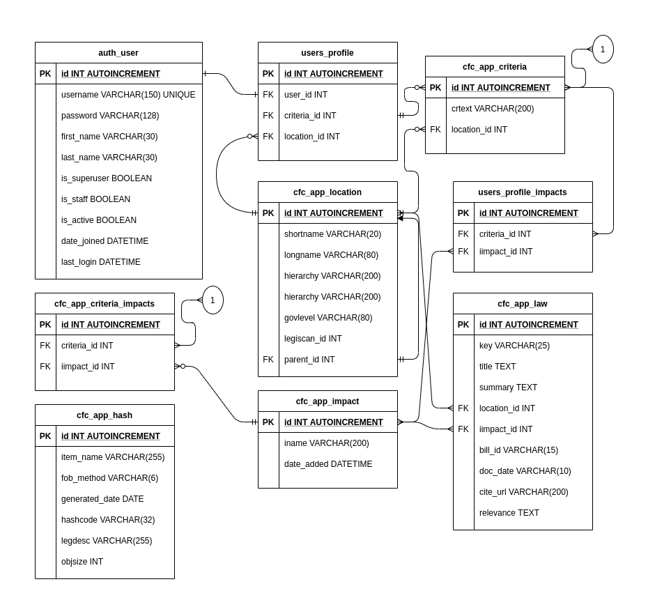

# DATABASE

This django application uses a single database, with many tables.  Some
of the tables are required to manage django itself, while others are unique
to this application.

```bash
auth_group                  cfc_app_criteria          django_admin_log 
auth_group_permissions      cfc_app_criteria_impacts  django_content_type   
auth_permission             cfc_app_hash              django_migrations  
auth_user                   cfc_app_impact            django_session
auth_user_groups            cfc_app_law               django_truncate_model1    
auth_user_user_permissions  cfc_app_location          django_truncate_model2  
users_profile             
users_profile_impacts     
```



